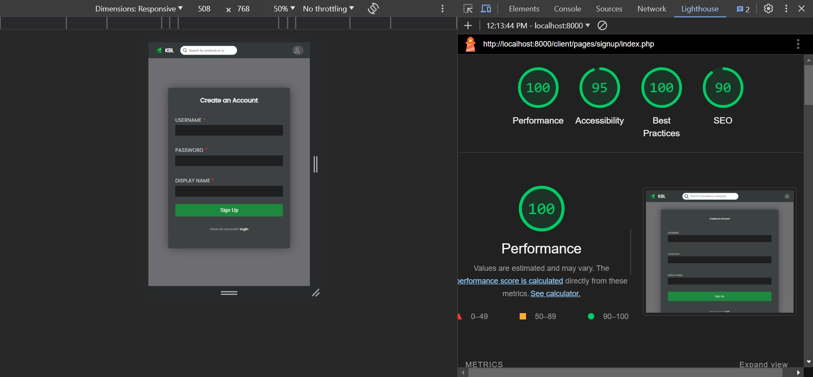
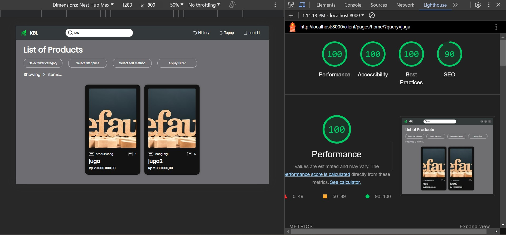
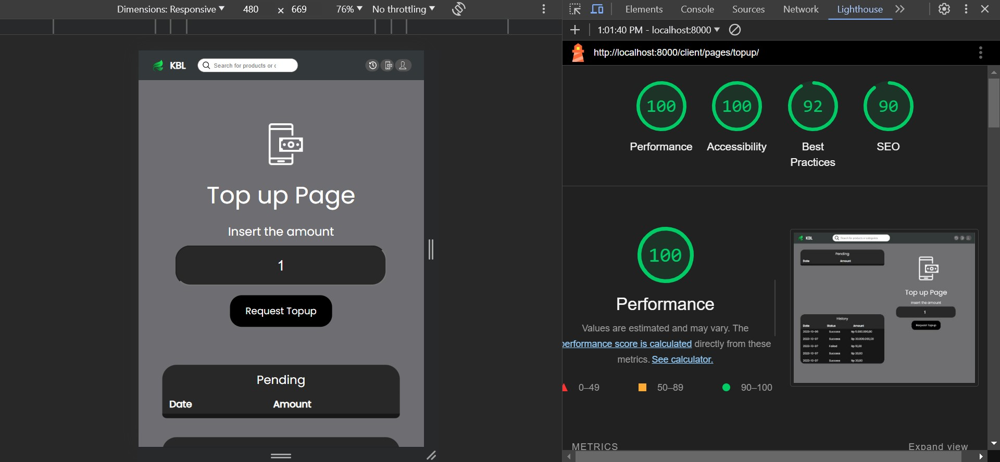

# KBL E-Commerce
Tugas Besar 1 IF3110 Web Based Development
<br />

## Table of Contents
* [General Info](#general-information)
* [Tampilan Program](#tampilan-program)
* [How To Install](#how-to-install)
* [How To Run](#how-to-run)
* [Requirements](#requirements)
* [Tech Stack](#tech-stack)
* [Tampilan Google Lighthouse](#tampilan-google-lighthouse)
* [Pembagian Tugas](#pembagian-tugas)
* [Credits](#credits)

## General Information
KBL adalah sebuah website e-commerce. Disini, pengguna dapat membeli produk-produk yang telah disediakan pada website. Untuk dapat membeli barang, pengguna perlu membuat akun dan melakukan login. Sebelum dapat membeli barang, pengguna perlu melakukan request top up untuk mengisi balance akun. Request top up ini hanya bisa disetujui atau ditolak oleh akun dengan role admin.

## Tampilan Program
* Home
> 
* Signup
> 
* Login
> 
* User Home
> 
* Search Product
> 
* Product Filter
> 
* Topup
> 
* History
> 
* Admin Home
> 
* Edit Product
> 
* Handle Topup
> 
* Edit User
> 
* Account Settings
> 

## How To Install
* Unduh Docker Desktop di situs resminya dan lakukan instalasi.
* Unduh PostgreSQL di situs resminya dan lakukan instalasi.

## How To Run
In terminal, run:
```shell
docker-compose up -d
```
After that, open http://localhost:8000/client/pages/home/ in your browser.

## Requirements
* Docker Desktop
* PostgreSQL

## Tech Stack
* HTML
* CSS
* JavaScript
* PHP

## Tampilan Google Lighthouse
* Home
> 
* Signup
> 
* Login
> 
* User Home
> 
* Search Product
> 
* Product Filter
> 
* TopUp
> 
* History
> 
* Admin Home
> 
* Edit Product
> 
* Handle Topup
> 
* Edit User
> 
* Settings
> 

## Pembagian Tugas
Server-side:
* Admin-Product-CRUD: 13521049
* Admin-Top-Up-CRUD: 13521049
* Admin-User-CRUD: 13521049
* Register: 13521064
* Login: 13521064
* Settings: 13521064
* History: 13521064
* Core Database : 13521108
* Docker : 13521108
* Routing : 13521108
* Home (Filter-sort-search-pagination) : 13521108
* User-Product : 13521108

Client-side:
* Admin-Product-CRUD: 13521049
* Admin-Top-Up-CRUD: 13521049
* Admin-User-CRUD: 13521049
* Register: 13521064
* Login: 13521064
* Settings: 13521064
* History: 13521064
* Docker : 13521108
* Routing : 13521108
* Home (Filter-sort-search-pagination) : 13521108
* User-Product : 13521108

## Credits
This project is implemented by:
1. Brian Kheng (13521049)
2. Bill Clinton (13521064)
3. Michael Leon Putra Widhi (13521108)
